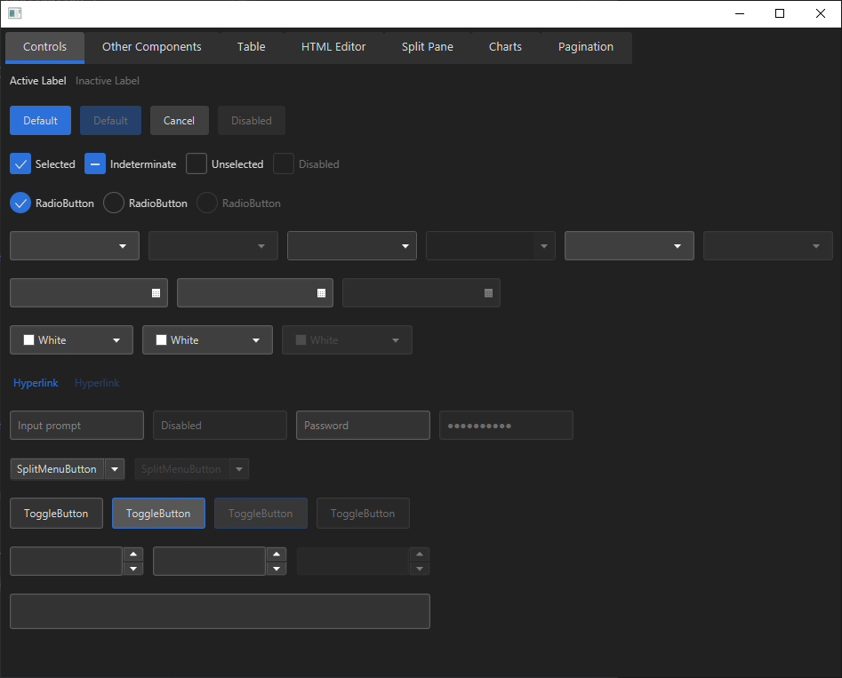

# JFX Waitomo Theme

[ ](https://bintray.com/micheljung/maven/jfx-waitomo-theme/_latestVersion)



## How to use:

```java
public class Main {
  public static void main(String[] args) {
    DemoApplication.launch(DemoApplication.class, args);
  }

  public static class DemoApplication extends Application {

    @Override
    public void start(Stage primaryStage) {
      Scene scene = new Scene(new StackPane());
      WaitomoTheme.apply(scene);

      primaryStage.setScene(scene);
      primaryStage.show();
    }
  }
}
```

## Get It Now

Get it via https://bintray.com/micheljung/maven/jfx-waimoto-theme/

```
implementation 'ch.micheljung.waitomo:jfx-waitomo-theme:0.2.0'
```

## Important

Not all components have been styled yet.

# Other Projects

Works great with [fxstage](https://github.com/micheljung/fxstage)!
